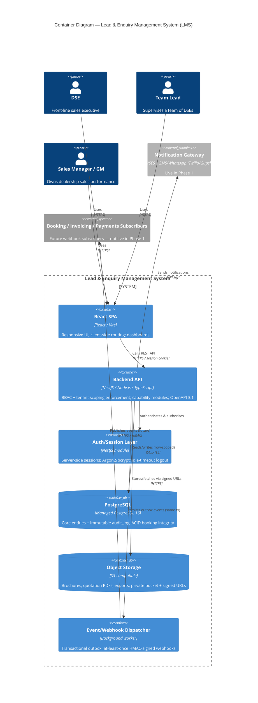
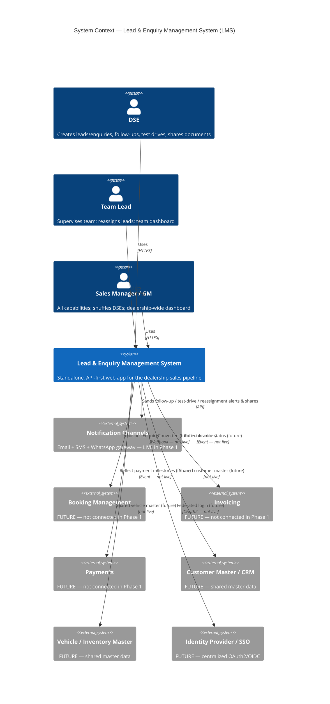

# Technical Design — Lead & Enquiry Management Web Application (LMS)

**Project**: Lead & Enquiry Management Web Application (LMS)
**Source BRD**: `LMS_1.md` (v2.0, 14-Jul-2026)
**Design ID**: lms-1
**Classification**: Internal / Confidential
**Status**: ⏳ Awaiting User Approval

> Scope note: LMS is a standalone, API-first web application for automotive dealerships serving a 3-tier, additive-inheritance role hierarchy (DSE → TL → SM/GM), designed for future integration with Booking Management, Invoicing, and Payments modules. All nine architecture decisions referenced here (ADR-001 … ADR-009) are Accepted; see `./adr/`. Full C4 Component, Sequence, and Deployment views live in `./architecture.drawio`.

---

## 1. Introduction

### 1.1 Purpose
This document is the TOGAF-aligned technical design for LMS. It translates the tech-agnostic BRD into a concrete, buildable architecture across the Business, Data, Application, and Technology domains, and captures quality attributes, architecture decisions, a STRIDE threat model, and full requirements traceability. It is the reference bridging the BRD and detailed FRD/implementation.

### 1.2 Scope
**In scope (Phase 1):** Responsive web app for DSE/TL/SM-GM personas; lead & enquiry lifecycle (capture → follow-up → test drive → brochure/quotation → conversion); role-appropriate dashboards and reporting; multi-outlet readiness; API-first design with event hooks for future modules.

**Out of scope (Phase 1):** Functional build of Booking/Invoicing/Payments (only integration-ready hooks); OEM/DMS integration; finance/e-KYC; after-sales; inventory beyond test-drive availability; customer self-service portal; native mobile app; multi-language localization.

### 1.3 Context
The dealership sales process is today run on manual registers, spreadsheets, and disconnected tools, causing lead leakage, poor pipeline visibility, test-drive double-booking, and slow brochure/quotation sharing. LMS digitizes the end-to-end lead/enquiry lifecycle and gives every hierarchy tier the visibility and controls needed. It ships as an independently deployable module (ADR-005) that requires no downstream module to function, while exposing REST APIs (ADR-006) and event webhooks so Booking/Invoicing/Payments can attach later without rework.

---

## 2. Business Architecture

### 2.1 Business Objectives
- Single web app to capture, track, and convert leads/enquiries, accessible from any desktop/laptop/tablet browser.
- Reduce lead leakage via systematized follow-ups with auto-generated next-follow-up dates and reminders.
- Digitize test-drive scheduling to maximize demo-vehicle utilization and eliminate double-booking.
- Enable instant in-app brochure/quotation sharing to shorten the sales cycle.
- Give DSEs a prioritized daily task list; give TL/SM-GM real-time dashboards and reassignment controls.
- Improve enquiry-to-booking conversion and responsiveness.
- Deliver standalone today; support future module integration with minimal rework.

### 2.2 Stakeholders
| Stakeholder | Role in Project |
| --- | --- |
| Dealership Principal / GM | Business sponsor; approves scope, budget, go-live. |
| Sales Manager | Defines dashboard KPIs; validates reassignment/reporting needs. |
| Team Leads (TL) | End users; team-management and follow-up workflow input. |
| Dealer Sales Executives (DSE) | Primary end users; day-to-day usability input. |
| IT / Technology Partner | Designs, builds, tests, deploys; owns integration architecture. |
| Business Analyst | Documents/validates requirements. |
| Future Module Owners (Booking/Invoicing/Payments) | Provide data/API-contract input for future integration. |

### 2.3 Business Capabilities
Lead & Enquiry Capture · Lead-to-Enquiry Qualification · Follow-up Management · Test-Drive Scheduling · Digital Document Sharing (brochure/quotation) · Task & Dashboard Management · Team Supervision & Reassignment (TL) · Dealership-wide Performance Management (SM/GM) · Multi-outlet Centralized Reporting.

**Role hierarchy (additive inheritance):** DSE (baseline capabilities) → TL (all DSE + team supervision/reassignment) → SM/GM (all TL + cross-team shuffle + dealership-wide dashboard). Enforced by the RBAC matrix in Section 12 of the BRD; single enforcement point is the Backend API (Section 4).

### 2.4 KPIs (dashboard-driven)
Lead-to-Enquiry Conversion % · Enquiry-to-Booking Conversion % · Follow-up Adherence % · Test-Drive-to-Booking Ratio · Average Task Turnaround Time · Source-wise Performance · DSE/TL Leaderboard Ranking.

---

## 3. Data Architecture

### 3.1 Core Entities
| Entity | Purpose | Key Attributes | Notes |
| --- | --- | --- | --- |
| **DealerGroup** | Top-of-hierarchy tenant grouping | `dealer_group_id`, name | Enables cross-location group reporting (ADR-003). |
| **Location / Outlet** | Physical dealership outlet | `location_id`, `dealer_group_id`, name, address | Every core row carries `location_id` for row-level scoping. |
| **User** | DSE/TL/SM-GM account | `user_id`, name, email, mobile, `role`, `team_id`, `location_id`, `dealer_group_id`, password_hash, status | Hierarchy mapping DSE→TL→SM/GM; role resolved fresh per request. |
| **Team** | TL-owned group of DSEs | `team_id`, `tl_user_id`, `location_id` | Basis for TL scoping and SM/GM shuffle. |
| **Lead** | Minimally-qualified interest | `lead_id`, customer name, mobile, source, model_of_interest, owner (DSE), `location_id`, created_by/on, status, `custom_fields` (JSONB) | Configurable mandatory fields via JSONB (ADR-002). |
| **Enquiry** | Qualified, actively-pursued record | `enquiry_id`, lead_id?, customer details, variant, budget, exchange, finance_interest, status (Hot/Warm/Cold/Lost/Booked), owner, `location_id`, `custom_fields` (JSONB) | Direct-create or converted from Lead. |
| **Follow-up** | Scheduled interaction | `followup_id`, enquiry_id, type (Home/Showroom/Call), remarks, outcome, next_followup_date, status | Drives task generation (FR-09). |
| **Test Drive** | Booked demo-vehicle slot | `testdrive_id`, enquiry_id, vehicle_id, slot_start, slot_end, status (Booked/Completed/No-show/Cancelled), remarks | Unique-constraint / `SELECT … FOR UPDATE` prevents double-booking (ADR-002). |
| **Vehicle (demo)** | Demo fleet master | `vehicle_id`, model, variant, `location_id`, availability | Master data; shared-master-data ready. |
| **Document Share Record** | Brochure/quotation share log | `share_id`, enquiry_id, type (brochure/quotation), object_key, channel, shared_by/on | PDF/asset stored in object storage (ADR-008). |
| **Task** | Daily actionable item | `task_id`, enquiry_id, type (follow-up/test-drive/documentation), due_datetime, owner, status | Derived; Today/Tomorrow/Later views. |
| **Reassignment Record** | Ownership-change trail | captured within `audit_log` | from/to/by/when/reason (FR-30). |
| **audit_log** | Immutable business/compliance trail | `audit_id`, actor, action, entity_type, entity_id, before/after, timestamp, `location_id`, `dealer_group_id` | Append-only; DB-level REVOKE UPDATE/DELETE + trigger (ADR-009). |
| **Outbox Event** | Transactional event record | `event_id`, type (`EnquiryConverted`, `LeadReassigned`), payload, status, retries | Written in same tx as state change (ADR-006). |

### 3.2 Data Flows
1. **Capture → Convert:** DSE creates Lead → duplicate check on mobile → qualifies → converts to Enquiry (writes Enquiry, audit_log, and `EnquiryConverted` outbox row in one transaction).
2. **Follow-up loop:** Follow-up logged → next-follow-up date set → Task auto-generated → notification dispatched (ADR-007).
3. **Test drive:** Slot chosen → uniqueness enforced at DB → Task/reminder created.
4. **Document share:** Quotation rendered server-side to PDF (ADR-008) → stored in object storage → short-TTL signed URL shared via notification channel → Share Record logged.
5. **Reporting:** TL/SM-GM dashboards run row-scoped SQL aggregation over leads/enquiries/follow-ups/test-drives; exportable to Excel/PDF.
6. **Event publication:** Outbox worker polls, dispatches HMAC-signed webhooks to (future) subscribers; outbound-only in Phase 1.

### 3.3 Data Classifications
| Class | Data | Handling |
| --- | --- | --- |
| **PII (Confidential)** | Customer name, mobile, email; quotation pricing | Encryption in transit (TLS) & at rest; role-based masking of full contact details; private object-storage bucket. |
| **Internal** | Enquiry status, follow-up remarks, KPIs, leaderboards | Row-level scoped by `location_id`/`dealer_group_id`. |
| **Security-sensitive** | Password hashes, session records | Argon2/bcrypt hashing (ADR-004); never logged. |
| **Audit (Immutable)** | audit_log entries | Append-only; non-repudiation trail. |

Row-level tenant scoping (`location_id` / `dealer_group_id`) applies to every core entity (ADR-003), enforced centrally in the data-access layer plus PostgreSQL Row-Level Security as defense-in-depth.

---

## 4. Application Architecture

### 4.1 Components
| Component | Responsibility | Key Decisions |
| --- | --- | --- |
| **React SPA** | Responsive UI for all personas; client-side routing enabling task-detail open without full page reload; dashboard rendering. | ADR-001 |
| **Backend API (NestJS)** | Single enforcement point for RBAC + tenant scoping; REST controllers/services for all capability modules; OpenAPI contract of record. | ADR-001, ADR-006 |
| **Auth/Session Layer** | Login, Argon2/bcrypt verification, server-side session issuance (HttpOnly/Secure/SameSite cookies), idle-timeout auto-logout, fresh per-request role resolution. | ADR-004 |
| **Data-Access Layer** | Central row-level scoping choke-point; migration-managed schema; JSONB configurable fields; transactional booking/audit writes. | ADR-002, ADR-003 |
| **PostgreSQL (incl. audit_log)** | Primary relational store; ACID booking integrity; SQL aggregation for dashboards; immutable audit trail. | ADR-002, ADR-009 |
| **Object Storage (S3-compatible)** | Brochures, generated quotation PDFs, exports; private bucket, signed short-TTL URLs. | ADR-008 |
| **Event/Webhook Dispatcher** | Background worker polling the transactional outbox; at-least-once, HMAC-signed webhook delivery; retry/backoff. | ADR-006 |
| **Notification Service** | Provider-agnostic abstraction with email (SMTP/SES) and unified SMS+WhatsApp adapters. | ADR-007 |
| **Document Service** | Server-side HTML-to-PDF quotation rendering; spreadsheet-library Excel export. | ADR-008 |
| **Observability Layer** | Structured JSON logging + basic APM/uptime probe (distinct from audit_log). | ADR-009 |

Capability modules inside the Backend API: Lead & Enquiry, Follow-up, Test Drive, Document Sharing, Task & Dashboard, Team Management (TL), Sales Management (SM/GM).

### 4.2 Interfaces
- **SPA ↔ API:** REST over HTTPS, session cookie auth; the SPA consumes the same published OpenAPI 3.1 API as any future consumer (no privileged path).
- **API ↔ PostgreSQL:** Row-scoped queries via the single data-access choke-point.
- **API ↔ Object Storage:** Signed-URL issuance; no file bytes proxied through the app server.
- **Dispatcher → Future subscribers:** Outbound HMAC-signed webhooks (`EnquiryConverted`, `LeadReassigned`); no live subscriber in Phase 1.
- **Notification Service → Gateway:** API-key-authenticated provider calls (live in Phase 1).

### 4.3 Sequence Views (summary — full detail in `architecture.drawio`, Sequence page)
- **Enquiry conversion:** SPA → API (authz guard → tenant scope) → DB tx {write Enquiry + audit_log + outbox row} → 200 → Dispatcher async webhook.
- **Test-drive booking:** SPA → API → DB `FOR UPDATE`/unique-constraint check → confirm or reject-on-conflict → Task + notification.
- **Quotation share:** SPA → API → Document Service (HTML→PDF) → Object Storage put → signed URL → Notification Service → Share Record.

See `architecture.drawio` for the full C4 Component, Sequence, and Deployment views.

### 4.4 C4 Container Diagram

---

## 5. Technology Architecture

### 5.1 Platforms & Stack
| Layer | Technology | Decision |
| --- | --- | --- |
| Frontend | React (Vite) SPA, TypeScript | ADR-001 |
| Backend | NestJS on Node.js, TypeScript | ADR-001 |
| Auth | Server-side sessions, HttpOnly/Secure/SameSite cookies, Argon2/bcrypt | ADR-004 |
| Database | PostgreSQL 16 (managed), JSONB configurable fields, RLS | ADR-002, ADR-003 |
| API contract | OpenAPI 3.1 (NestJS decorators) | ADR-006 |
| Events | Transactional-outbox webhooks | ADR-006 |
| Notifications | Provider-agnostic abstraction; SMTP/SES + Twilio/Gupshup/MSG91 | ADR-007 |
| Documents | S3-compatible storage; server-side HTML-to-PDF; spreadsheet library | ADR-008 |
| Observability | audit_log (Postgres) + structured JSON logging + basic APM/uptime | ADR-009 |

### 5.2 Hosting & Deployment
Containerized (Docker) frontend build + NestJS backend deployed to a managed container service (managed Kubernetes / ECS-Fargate / equivalent) in a single cloud region, with managed PostgreSQL and S3-compatible object storage (ADR-005). Independently deployable — requires no downstream module to run. Deployment topology detail in `architecture.drawio` (Deployment page).

### 5.3 Dependencies
- Migration tool (TypeORM/Prisma/Flyway) for shared-schema discipline (ADR-002).
- WhatsApp Business API template pre-approval — external lead-time risk (ADR-007).
- HTML-to-PDF rendering engine (memory/CPU sized and rate-limited).
- Managed-service provider selection (region SLA ≥ 99.5% business-hours target).

### 5.4 C4 Context Diagram

---

## 6. Quality Attributes (NFRs → Scenarios)

| NFR | Requirement | Architectural Scenario / Mechanism |
| --- | --- | --- |
| **Performance** | Key pages load < 3 s on broadband | SPA code-splitting/caching; indexed SQL + GIN indexes on JSONB; server-side aggregation, not client-side. |
| **Availability** | 99.5% uptime in business hours | Managed container service + managed PostgreSQL health checks/failover/backups; single-region SLA documented (ADR-005). |
| **Usability** | Responsive desktop/laptop/tablet; minimal clicks | React responsive layout; no-reload task detail (client routing, ADR-001). |
| **Browser Compatibility** | Latest 2 versions of Chrome/Edge/Firefox/Safari | Supported-matrix QA; standards-based SPA build. |
| **Security** | RBAC; TLS in transit + at rest; masked contact display; auto-logout | Backend API single enforcement point; Auth layer (ADR-004); row-level scoping (ADR-003); role-based masking. |
| **Scalability** | Single dealership → multi-outlet group, no redesign | Single DB / shared schema + `location_id`/`dealer_group_id` scoping (ADR-003); replica-count/instance-tier resizing (ADR-005). |
| **Auditability** | All create/update/reassign/delete logged with user/time/detail | Immutable audit_log; append-only, DB-level REVOKE + trigger (ADR-009). |
| **Notifications** | In-app/email/SMS/WhatsApp for due tasks & reassignments | Provider-agnostic Notification Service + adapters (ADR-007). |
| **Modularity** | Self-contained, API-first, integration-ready without re-architecture | OpenAPI 3.1 contract + transactional-outbox webhooks (ADR-006); independent deployability (ADR-005). |

---

## 7. Architecture Decisions

| ADR | Decision | File |
| --- | --- | --- |
| ADR-001 | React (Vite) SPA + NestJS/TypeScript backend | [`./adr/ADR-001.md`](./adr/ADR-001.md) |
| ADR-002 | Single managed PostgreSQL 16 primary data store | [`./adr/ADR-002.md`](./adr/ADR-002.md) |
| ADR-003 | Single DB / shared schema + row-level location scoping | [`./adr/ADR-003.md`](./adr/ADR-003.md) |
| ADR-004 | Stateful server-side sessions for Phase-1 auth | [`./adr/ADR-004.md`](./adr/ADR-004.md) |
| ADR-005 | Containerized deployment to managed container service + managed PostgreSQL | [`./adr/ADR-005.md`](./adr/ADR-005.md) |
| ADR-006 | OpenAPI 3.1 contract + transactional-outbox webhooks | [`./adr/ADR-006.md`](./adr/ADR-006.md) |
| ADR-007 | Provider-agnostic notification abstraction (email/SMS/WhatsApp) | [`./adr/ADR-007.md`](./adr/ADR-007.md) |
| ADR-008 | Object storage + server-side HTML-to-PDF + spreadsheet export | [`./adr/ADR-008.md`](./adr/ADR-008.md) |
| ADR-009 | Two-layer observability: immutable audit_log + structured logging/APM | [`./adr/ADR-009.md`](./adr/ADR-009.md) |

---

## 8. Threat Model (STRIDE)

### 8.1 STRIDE Analysis — Components
Component-level threat table covering **React SPA Frontend, Backend API (NestJS), Auth/Session Layer, PostgreSQL (+ audit_log), Object Storage (S3-compatible), Event Dispatcher (transactional outbox/webhooks), Notification Gateway** — each assessed across all six STRIDE categories (Spoofing, Tampering, Repudiation, Information Disclosure, Denial of Service, Elevation of Privilege), each with Applicable Yes/No, Risk rating, and Mitigation.

**Key findings:**
- **Backend API** — rated **CRITICAL** on Spoofing / Tampering / Information Disclosure / Elevation of Privilege; it is the single enforcement point for the additive-inheritance RBAC matrix and tenant row-level scoping.
- **PostgreSQL + audit_log** — rated **CRITICAL** on Tampering / Repudiation / Information Disclosure; audit_log immutability via DB-level `REVOKE UPDATE/DELETE` plus an enforcement trigger; Row-Level Security keyed on `location_id` / `dealer_group_id` as defense-in-depth.
- **Object Storage** — rated **CRITICAL** on Information Disclosure (quotation PDFs contain PII + pricing); mitigated via private bucket, non-guessable UUID keys, short-TTL pre-signed URLs, and encryption at rest.
- **Auth/Session Layer** — rated **HIGH** across Spoofing / Information Disclosure / Elevation of Privilege; Argon2/bcrypt hashing, progressive backoff, session-ID regeneration on login, and role resolved fresh per request (never trusted from client).
- **Event Dispatcher** — Elevation-of-Privilege marked **Not Applicable** (no live subscriber in Phase 1; outbound-only trust model; any future inbound callback requires its own ADR-reviewed authN/authZ contract).
- **Notification Gateway** — rated **MEDIUM** across the board; SPF/DKIM/DMARC, API-key auth, fixed parameterized templates, PII minimization in message bodies.

### 8.2 STRIDE Analysis — Cross-Trust-Boundary Interfaces
**Trust zones:** Internet (browser) → DMZ/Internal (Backend API, Event Dispatcher, Auth) → Restricted (PostgreSQL, Object Storage) → External (notification providers, future module subscribers).

| Interface | Rating | Mitigation |
| --- | --- | --- |
| Browser → Backend API | **CRITICAL** (Spoofing / Elevation of Privilege) | Mandatory session-validation middleware; uniform deny-by-default authz guard on all routes. |
| Backend API → PostgreSQL | **CRITICAL** (Information Disclosure) | Mandatory tenant-scope filter at a single choke-point query layer plus PostgreSQL RLS as defense-in-depth. |
| Backend API → Object Storage | **CRITICAL** (Information Disclosure) | Private bucket, non-guessable keys, short-TTL pre-signed URLs. |
| Event Dispatcher → future Booking/Invoicing/Payments subscribers | **MEDIUM** | HMAC-signed payloads; subscriber auth contract formalized via ADR before any subscriber goes live; Elevation-of-Privilege N/A (theoretical only in Phase 1). |
| Backend API → Notification Gateway providers | **MEDIUM** | API-key auth; recipient scope validated against actor's authorized customers before send. |

### 8.3 Elevated-Surface Components (flag for reviewer attention)
- **Auth/Session Layer** — anchors every RBAC decision across DSE → TL → SM/GM; failure cascades into unauthorized cross-team/cross-location access.
- **PostgreSQL + audit_log** — holds all customer PII, pricing, and the immutable audit trail underpinning non-repudiation.
- **Object Storage** — quotation PDFs contain customer PII and pricing; misconfiguration is a common real-world Information Disclosure class.
- **Backend API (NestJS)** — single enforcement point for the additive-inheritance RBAC matrix and tenant row-level scoping named explicitly in the BRD.

**Coverage:** all 7 components × 6 STRIDE categories (42 assessments) + 5 cross-boundary interfaces × 6 categories (30 assessments) = **72 total**, with every "Yes" entry carrying a concrete mitigation and every "No" entry carrying an explicit rationale.

---

## 9. Requirements Traceability Matrix

### 9.1 Functional Requirements → Component / ADR
| FR | Requirement (summary) | Component(s) | ADR |
| --- | --- | --- | --- |
| FR-01 | Create Lead (mandatory fields) | SPA, Lead & Enquiry Module, PostgreSQL | ADR-001, ADR-002 |
| FR-02 | Convert Lead → Enquiry | Lead & Enquiry Module, Event Dispatcher | ADR-002, ADR-006 |
| FR-03 | Create Enquiry directly | Lead & Enquiry Module | ADR-002 |
| FR-04 | Configurable mandatory fields | Lead & Enquiry Module, Data-Access Layer (JSONB) | ADR-002 |
| FR-05 | Auto-capture metadata (created-by/on, owner) | Lead & Enquiry Module, audit_log | ADR-009 |
| FR-06 | Duplicate mobile/lead detection | Lead & Enquiry Module, PostgreSQL | ADR-002 |
| FR-07 | Log follow-up (Home/Showroom/Call) | Follow-up Module | ADR-002 |
| FR-08 | Free-text follow-up remarks | Follow-up Module | ADR-002 |
| FR-09 | Next-follow-up date + auto reminder/task | Follow-up Module, Task Module, Notification Service | ADR-007 |
| FR-10 | Chronological follow-up timeline (role-scoped) | Follow-up Module, Data-Access Layer | ADR-003 |
| FR-11 | Update enquiry status (Hot/Warm/Cold/Lost/Booked) | Follow-up Module | ADR-002 |
| FR-12 | Book test drive (vehicle/date/slot) | Test Drive Module | ADR-002 |
| FR-13 | Test-drive scheduler (open/booked slots) | SPA, Test Drive Module | ADR-001, ADR-002 |
| FR-14 | Prevent double-booking | Test Drive Module, PostgreSQL (locking/unique) | ADR-002 |
| FR-15 | Auto task/reminder before test drive | Task Module, Notification Service | ADR-007 |
| FR-16 | Mark Completed/No-show/Cancelled + remarks | Test Drive Module | ADR-002 |
| FR-17 | Share brochure (WhatsApp/SMS/Email) | Document Service, Notification Service, Object Storage | ADR-007, ADR-008 |
| FR-18 | Generate & share quotation PDF | Document Service (HTML→PDF), Object Storage | ADR-008 |
| FR-19 | Log every brochure/quotation share | Document Share Record, audit_log | ADR-008, ADR-009 |
| FR-20 | Task counter (day, ascending due time) | SPA, Task & Dashboard Module | ADR-001 |
| FR-21 | Task list; open detail without page reload | SPA (client routing), Task Module | ADR-001 |
| FR-22 | Tasks incl. follow-ups/test-drives/docs | Task Module | ADR-002 |
| FR-23 | Today / Tomorrow / Later tabs | SPA, Task Module | ADR-001 |
| FR-24 | Complete/reschedule task → updates follow-up | Task Module, Follow-up Module | ADR-002 |
| FR-25 | TL view team DSEs + active counts | Team Management Module, Data-Access Layer | ADR-003 |
| FR-26 | TL drill into DSE leads (stage/ageing/last FU) | Team Management Module | ADR-003 |
| FR-27 | TL comment on team enquiries | Team Management Module | ADR-003 |
| FR-28 | TL record follow-up on DSE enquiry | Team Management Module, Follow-up Module | ADR-003 |
| FR-29 | TL reassign lead within team | Team Management Module, Event Dispatcher | ADR-003, ADR-006 |
| FR-30 | Audit trail of reassignments | audit_log | ADR-009 |
| FR-31 | Team Performance Dashboard (leaderboard, %alloc, %conv) | SPA, Team Management Module, PostgreSQL aggregation | ADR-002 |
| FR-32 | SM/GM all DSE + TL capabilities | Sales Management Module, Backend API RBAC | ADR-001, ADR-003 |
| FR-33 | SM/GM shuffle DSEs across teams | Sales Management Module, audit_log | ADR-003, ADR-009 |
| FR-34 | Dealership-wide consolidated dashboard | SPA, Sales Management Module, PostgreSQL aggregation | ADR-002, ADR-003 |
| FR-35 | Filter dashboards (date/source/model/TL/location) | Sales Management Module, Data-Access Layer | ADR-003 |
| FR-36 | Exportable reports (Excel/PDF) | Document Service (spreadsheet/PDF) | ADR-008 |

### 9.2 Non-Functional Requirements → Component / ADR
| NFR | Requirement | Component(s) | ADR |
| --- | --- | --- | --- |
| NFR-01 Performance | < 3 s key-page load | SPA, PostgreSQL indexing | ADR-001, ADR-002 |
| NFR-02 Availability | 99.5% business-hours uptime | Managed container service + managed PostgreSQL | ADR-005 |
| NFR-03 Usability | Responsive; minimal clicks | React SPA | ADR-001 |
| NFR-04 Browser Compatibility | Latest 2 Chrome/Edge/Firefox/Safari | React SPA | ADR-001 |
| NFR-05 Security | RBAC, TLS, masking, auto-logout | Backend API, Auth Layer, Data-Access Layer | ADR-003, ADR-004 |
| NFR-06 Scalability | Single → multi-outlet, no redesign | Single DB/shared schema + scoping | ADR-003, ADR-005 |
| NFR-07 Auditability | Log create/update/reassign/delete | audit_log | ADR-009 |
| NFR-08 Notifications | In-app/email/SMS/WhatsApp | Notification Service + adapters | ADR-007 |
| NFR-09 Modularity | API-first, integration-ready standalone | OpenAPI 3.1 + outbox webhooks; independent deploy | ADR-006, ADR-005 |

---

## 10. Sign-off

> Review block — not a gate. This technical design was generated during Phase 4 (Design). Please review and approve before proceeding to Phase 5.

| Name | Role | Review | Date |
| --- | --- | --- | --- |
|  | Dealership Principal / GM |  |  |
|  | Sales Manager |  |  |
|  | IT / Technology Partner |  |  |
|  | Business Analyst |  |  |

**Status**: ⏳ Awaiting User Approval

*References: BRD `LMS_1.md`; ADRs `./adr/ADR-001.md` … `./adr/ADR-009.md`; architecture views `./architecture.drawio` (Context, Container, Component, Sequence, Deployment).*
